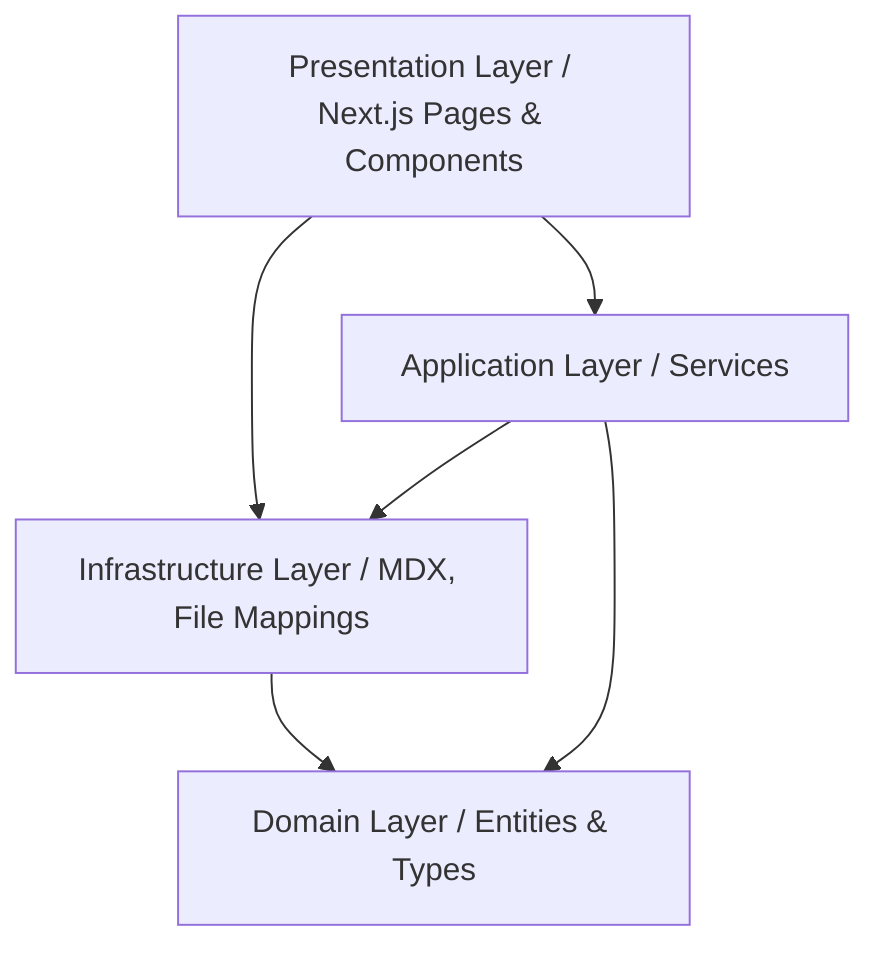

# Project Architecture Overview

This project is built using **Clean Architecture** (also known as Hexagonal or Onion Architecture) combined with Domain-Driven Design (DDD) principles. It is structured into clearly decoupled layers to ensure maintainability, testability, and independence from external frameworks.

## Dependency Rule

Dependencies only point **inward**. The core domain layer has no knowledge of any databases, file systems, or presentation frameworks (like Next.js).

---

## Layers breakdown

### 1. Domain Layer (`src/domain`)
The domain layer holds the core business entities, types, and validation rules. It has no external dependencies and represents the business models of the application.
* **Key Files**:
  * [Article.ts](file:///Users/mstefanutti/workspace/mstefa/src/domain/Article.ts): Defines `Article`, `ArticleMetadata`, and `Post` types.
  * [Job.ts](file:///Users/mstefanutti/workspace/mstefa/src/domain/Job.ts), [Education.ts](file:///Users/mstefanutti/workspace/mstefa/src/domain/Education.ts), [PersonalInfo.ts](file:///Users/mstefanutti/workspace/mstefa/src/domain/PersonalInfo.ts), [Project.ts](file:///Users/mstefanutti/workspace/mstefa/src/domain/Project.ts): Core CV-related domain types.

### 2. Application Layer (`src/application`)
The application layer contains the business use cases. It orchestrates the domain models and coordinates with infrastructure gateways or repositories to satisfy use case requests.
* **Key Files**:
  * [article.service.ts](file:///Users/mstefanutti/workspace/mstefa/src/application/article.service.ts): Formats raw metadata using helper tools (such as `dayjs` and `reading-time`) and fetches articles via the repository.

### 3. Infrastructure Layer (`src/infrastructure`)
The infrastructure layer implements technical details such as loading data from the filesystem or external services. It fulfills interfaces defined or consumed by the application layer.
* **Key Files**:
  * [mdx-file-repository.ts](file:///Users/mstefanutti/workspace/mstefa/src/infrastructure/file-managment/mdx-file-repository.ts): Uses Node's `fs` module and `glob` to locate and parse `.mdx` files from the filesystem.

### 4. Presentation Layer (`src/app` & `src/components`)
The presentation layer is composed of Next.js App Router components and React UI components. It is responsible for handling user interactions, routing, page layouts, and rendering content.
* **Key Directory**: [src/app](file:///Users/mstefanutti/workspace/mstefa/src/app)
